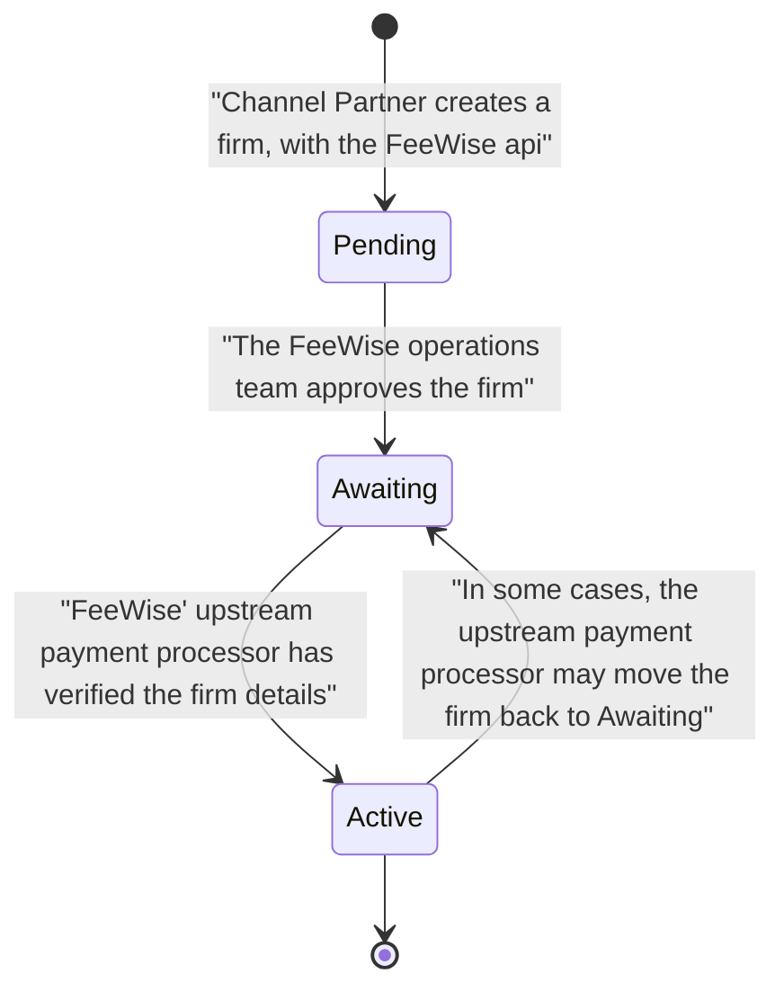

# Firm Onboarding

## Introduction
In FeeWise, a firm's status can be either `Pending`, `Awaiting`, or `Active`.

Only firms with an `Active` status, approved by the FeeWise operations team, can create payment artifacts or process payments.

The descriptions of each FeeWise firm status are outlined below. 

## Checking the status of a firm
The following example curl uses the `List Firms` endpoint to check the status of a firm.

```bash
curl -s 'https://papi.int.us.getfeewise.com/api/v3/partner/firms'    \
    --header 'X-Channel-Partner-Id: random-0000-4000-a000-000000000000'  \
    --header 'X-API-KEY: random-964f-4472-930a-81bd215a3492'  \
    --header 'Content-Type: application/json'  \
    --header 'Accept: application/json'  \
    --header 'X-Correlation-Id: 8f6155d0-ec8d-4cc8-a3c0-d63e70f5366f' \
    | jq '.firms[].company | {firm_id,legal_name,status}' # List all firms
```
Response
```bash
{
  "firm_id": "64e027cc-d6bf-4c8e-8a0a-664e59f19e3d",
  "legal_name": "Firm 1",
  "status": "Active"
}
{
  "firm_id": "d200ce5d-912f-4bdc-a7ce-3cb5f36ac8cb",
  "legal_name": "Firm 2",
  "status": "Awaiting"
}
{
  "firm_id": "e300ce5d-912f-4bdc-a7ce-3cb5f36ac8cb",
  "legal_name": "Firm 3",
  "status": "Pending"
}
```

## Firm status states
### Pending status
When a Channel Partner creates a firm, its status is initially set to `Pending`.

### Awaiting status
The FeeWise operations team reviews the firm details and, if applicable, approves the firm for further verification. Once approved, the firm’s status changes to `Awaiting`.

### Active status
The upstream payment processor verifies the firm details. 

Upon successful verification, the firm’s status changes to `Active`, enabling it to create payment artifacts and process payments


### Reverting of Active to Awaiting status
In rare cases, the upstream payment processor may revert the firm’s status to Awaiting if additional information or documentation is needed to verify the firm’s details

In such instances, the FeeWise operations team will have already contacted the firm for the required information, making this state change uncommon.

### Firm status state diagram



## Firm status updated, webhook events
Each state change will trigger a webhook event if the channel partner has registered a webhook for the event type.
The event type to register for is `firm.status.updated`.

Example `firm.status.updated` webhook

```json
{
  "url": "https://channel-partners-site/fb4351ee-7feb-47b7-91cd-d410e56859bb",
  "body": {
    "event": {
      "status": "Active",
      "firm_id": "c713a261-5328-450d-bc03-b930114ce4dc",
      "legal_name": "Some Law Firm.",
      "external_id": "some_external_id",
      "trading_name": "Some Mar Firm"
    },
    "event_id": "a3e76e01-5d51-404f-b92e-4d1f71caefa8",
    "created_at": "2024-06-03T01:42:22.434838Z",
    "event_type": "firm.status.updated"
  }
}

```

Note: Follow best practices when handling webhook events to ensure reliable and secure processing. 

For guidance, refer to [these best practices](https://www.stigg.io/blog-posts/best-practices-i-wish-we-knew-when-integrating-stripe-webhooks
) for integrating webhooks into your system.
