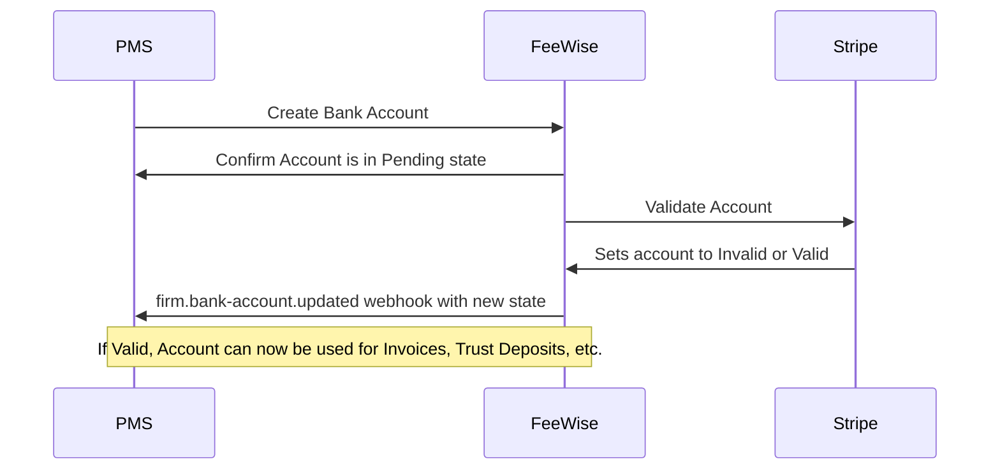

[Overview](./README.md)


# Bank Accounts
Bank accounts in FeeWise represent settlement destinations for firms' payments. Each firm can have multiple office and trust accounts.

# Core Principles
- Each firm must have at least one office account
- Bank account details cannot be modified after creation. Create new accounts instead of modifying existing ones.
- Each [account type](reference/partner-openapispec.yaml/components/schemas/AccountType) can have a designated default account.
- When [creating an account](reference/partner-openapispec.yaml/paths/~1api~1v3~1partner~1firms~1{firm_id}~1accounts/post), FeeWise will respond to any valid initial requests where the account doesn't already exist with a `201 - Created` status. When the account is later validated/invalidated, a `firm.bank-account.updated` webhook will be emitted with the new status.
- Bank account validation follows [Stripe's validation rules](https://docs.stripe.com/connect/payouts-bank-accounts?bank-account-collection-integration=direct-api&bank-account-collection-method=manual-entry&account-country=US#collecting-external-accounts), which vary by region.
- Deleting bank accounts using the [`/delete` endpoint](reference/partner-openapispec.yaml/paths/~1api~1v3~1partner~1firms~1{firm_id}~1accounts~1{account_id}/delete) performs a soft delete, rather than fully deleting the account.

# Bank Account Flow

Below is the standard flow for creating a new bank account.



# Creating a Bank Account
Create a new bank account for a firm using the [create bank account endpoint](reference/partner-openapispec.yaml/paths/~1api~1v3~1partner~1firms~1{firm_id}~1accounts/post), using the below model:

```yaml json_schema
$ref: "../reference/partner-openapispec.yaml#/components/schemas/BankAccount"
```

Some time after creating the bank account, you'll receieve a  `firm.bank-account.updated` webhook indicating whether the account is `Valid` or `Invalid`.

If the account is `Valid`, you may use the `account_id` in subsequent requests to the FeeWise API that require an `account_id`.

If the account is `Invalid`, ensure you passed the correct account details with your request. If the details are correct, contact FeeWise support to investigate the validation error.

# Webhooks
FeeWise sends webhooks for bank account events. Subscribe to these events to track account status:

- `firm.bank-account.created`
- `firm.bank-account.updated`
- `firm.bank-account.deleted`

[See our webhooks documentation](./WEBHOOKS.md) to learn how to subscribe to these webhook events.

## Event Payload Examples

### `firm.bank-account.created`
```json
{
  "event": {
    "bank": "Rapid Bank of America",
    "alias": "Stooges Office Account",
    "status": "Pending",
    "firm_id": "facade00-0000-4000-a000-000000000000",
    "account_id": "5f418fce-06a1-4a24-bc94-37e01f3fb999",
    "branch_code": "123-123",
    "account_name": "Ted Healy",
    "account_type": "Office",
    "country_code": "AU",
    "account_number": "123456789",
    "last_updated_at": "2025-06-06T02:05:02.473117Z",
    "account_holder_type": "Company"
  },
  "event_id": "dbc56853-1445-4cf1-80a7-46df3cba6141",
  "created_at": "2025-06-06T02:05:05.131095Z",
  "event_type": "firm.bank-account.created"
}
```

### `firm.bank-account.updated`
```json
{
  "event": {
    "bank": "Rapid Bank of America",
    "alias": "Stooges Office Account",
    "status": "Valid",
    "firm_id": "facade00-0000-4000-a000-000000000000",
    "account_id": "5f418fce-06a1-4a24-bc94-37e01f3fb999",
    "branch_code": "123-123",
    "account_name": "Ted Healy",
    "account_type": "Office",
    "country_code": "AU",
    "account_number": "123456789",
    "last_updated_at": "2025-06-06T02:05:06.218368Z",
    "account_holder_type": "Company"
  },
  "event_id": "893bb8e1-2f32-4226-bed3-bbb82402c0d9",
  "created_at": "2025-06-06T02:05:10.137692Z",
  "event_type": "firm.bank-account.updated"
}
```

### `firm.bank-account.deleted`
```json
{
  "event": {
    "bank": "Rapid Bank of America",
    "alias": "Stooges Office Account",
    "status": "Valid",
    "firm_id": "facade00-0000-4000-a000-000000000000",
    "account_id": "5f418fce-06a1-4a24-bc94-37e01f3fb999",
    "branch_code": "123-123",
    "account_name": "Ted Healy",
    "account_type": "Office",
    "country_code": "NZ",
    "account_number": "123456789",
    "last_updated_at": "2025-06-06T02:05:06.218368Z",
    "account_holder_type": "Company"
  },
  "event_id": "d8afc75c-5b3c-47e1-85e6-e321ad1a82a6",
  "created_at": "2025-06-06T02:08:00.422909Z",
  "event_type": "firm.bank-account.deleted"
}
```
