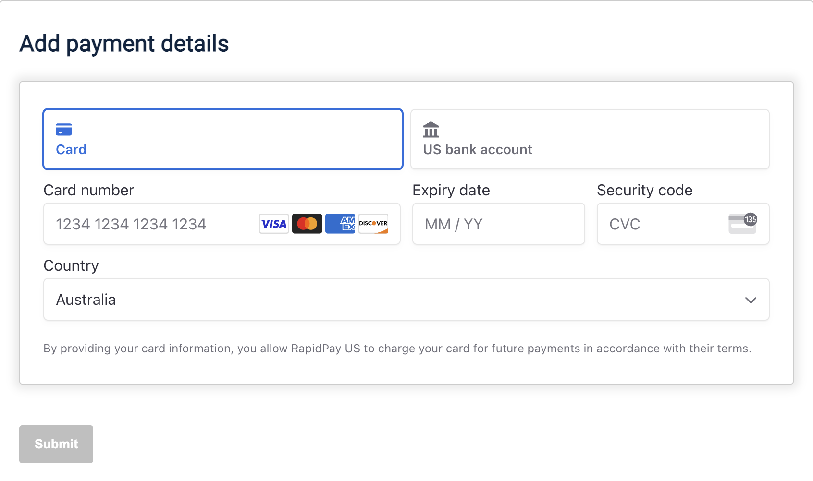
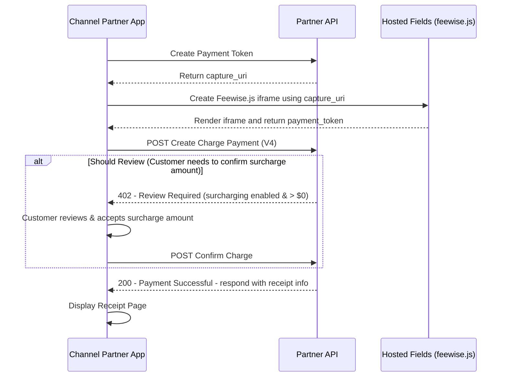

# Hosted Fields

## **Integrate Feewise into your checkout flow using payment tokens**

Hosted Fields allows you to import a Feewise module into your application, integrating our payment flow into your existing user journey.

---

This guide provides instructions for setting up Feewise Hosted Fields with your own checkout flow. This includes:

- [Setup Guide](#setup-guide)
- [Information flow](#hosted-fields-information-flow)

---

## Setup Guide


1. **Generate a Payment Token**
    - Your backend service must create a `payment_token` using the Feewise Partner API.
    - Make a `POST` request to:
      ```plaintext
      /api/v3/partner/firms/{firm_id}/payment_token
      ```  
    - Refer to the [API reference](../../reference/partner-openapispec.yaml/paths/~1api~1v3~1partner~1firms~1{firm_id}~1payment_token/post) for request and response details.
<br />

---

<br />

2. **Front-End Task: Mount the Hosted Fields Component**
    - On the front-end, extract the `capture_uri` from the API response.
    - Use it to mount the Hosted Fields component by calling:
      ```javascript
      setupFeewise(capture_uri, false, true, options);
      ```  
    - The first boolean parameter is `unMountOnSuccess` - whether to unmount Feewise after a successful submission and response is returned.
    - The second boolean parameter is `collectBillingDetails` - when true, fields for first name, last name, address and phone number will be present.
    - The `options` parameter is optional and follows the format of [Stripe's Elements Options](https://docs.stripe.com/js/elements_object/create#stripe_elements-options), allowing you to customize the component's appearance.
<br />

---

<br />

Once mounted, the Hosted Fields component will render a payment input field inside an iframe. This iframe communicates securely with the FeeWise backend APIs to process the payment details.
<br />

---

<br />

3. **Payment Confirmation**
    - To facilitate secure communication between the iframe and the parent container, the iframe uses the `postMessage` JavaScript API. This method allows the iframe to send messages to the parent window, ensuring a secure and reliable exchange of data.
    - The parent container should listen for messages from the iframe and handle them appropriately, following the guidelines for using `postMessage` securely.
      Once the parent container receives a payment message from the iframe, it should send the payment details to its backend, which should then make a server-side request to the FeeWise Partner API to create and confirm the customer payment.
      (eg [Create a Charge](./CREATE_A_CHARGE.md))
    - See the section below, with a detailed information flow diagram.


<br />

---

<br />

4. **Example UI with Hosted Fields** 



## Hosted Fields Information Flow

The following diagram is a top-level overview on the information flow, when using Feewise Hosted Fields. For a step-by-step setup guide, see the [Setup Guide](#setup-guide).

### End-to-end Hosted Fields Information Diagram


