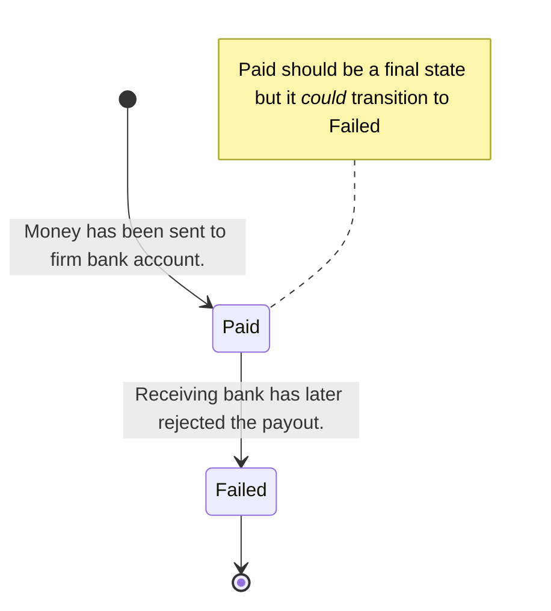

[ Overview](./README.md)

# Payout Events

As payouts are made by the system, events may be sent to any registered webhooks

Note that a payout.failed event may be received for a payout **after** a payout.paid event has been sent for that payout. 
Once a payout.failed event has been received for a payout, there will be no subsequent payout.paid for that payout.

## Webhooks Subscription

### payout.paid 

[Register a webhook](../../reference/partner-openapispec.yaml/paths/~1api~1v3~1partner~1webhooks/post) URL to 
receive the webhook event type `payout.paid`

Events posted to that URL for that event type will contain an 
[event envelop](../../reference/partner-openapispec.yaml/components/schemas/WebhookEvent) containing a 
[Payout](../../reference/partner-openapispec.yaml/components/schemas/Payout) 

### payout.failed

[Register a webhook](../../reference/partner-openapispec.yaml/paths/~1api~1v3~1partner~1webhooks/post) URL to
receive the webhook event type `payout.failed`

Events posted to that URL for that event type will contain an
[event envelop](../../reference/partner-openapispec.yaml/components/schemas/WebhookEvent) containing a
[Payout](../../reference/partner-openapispec.yaml/components/schemas/Payout) 

